# TradeFirewall

**TradeFirewall** is a pre-trade crypto risk engine that helps users analyze a proposed trade before execution.

Instead of acting like a normal crypto signal bot, TradeFirewall works as a **risk-control layer**. A user enters a trade idea, the app fetches real market data, calculates a risk score, explains the risk in simple language, recommends a safer action, and blocks or warns users before risky execution paths.

> TradeFirewall helps users avoid bad trades before they happen.

---

## Table of Contents

- [Overview](#overview)
- [Problem](#problem)
- [Solution](#solution)
- [Core Features](#core-features)
- [How TradeFirewall Works](#how-tradefirewall-works)
- [System Architecture](#system-architecture)
- [User Flow](#user-flow)
- [Data Flow](#data-flow)
- [Risk Engine](#risk-engine)
- [SoSoValue Integration](#sosovalue-integration)
- [SoDEX Integration](#sodex-integration)
- [Rule-Based Risk Explanation](#rule-based-risk-explanation)
- [Pages](#pages)
- [API Routes](#api-routes)
- [Storage](#storage)
- [Button Behavior](#button-behavior)
- [Environment Variables](#environment-variables)
- [Installation](#installation)
- [Running Locally](#running-locally)
- [Project Structure](#project-structure)
- [Safety Rules](#safety-rules)
- [Business Model](#business-model)
- [Roadmap](#roadmap)
- [Disclaimer](#disclaimer)

---

## Overview

TradeFirewall is designed for:

- Crypto traders
- DeFi users
- Signal groups
- Trading communities
- Wallets
- Trading bots
- DAO treasuries
- Small fund managers
- Market researchers

The product allows users to check a proposed trade before taking action.

Example:

```text
Buy $5,000 SOL
Holding Period: Intraday
Risk Profile: Conservative
```

TradeFirewall analyzes this trade and returns:

```text
Risk Score: 82/100
Decision: BLOCK
Main Risk: High volatility, weak liquidity, large position size
Recommended Action: Reduce size or wait for stronger confirmation
```

---

## Problem

Crypto users often make trades based on hype, emotion, incomplete data, or social signals.

Common problems include:

- Traders enter positions without checking risk.
- Signal groups push trades without context.
- Users do not understand volatility, liquidity, or slippage.
- Execution risk is ignored until it is too late.
- Market data and trading execution are disconnected.
- Users often need a simple answer: proceed, reduce, wait, or cancel.

Most crypto tools focus on finding opportunities.

TradeFirewall focuses on preventing dangerous trades.

---

## Solution

TradeFirewall creates a risk-control layer between trade idea and execution.

It helps users answer:

- Is this trade risky?
- Is the position size too large?
- Is liquidity strong enough?
- Is volatility too high?
- Is market momentum weak?
- Should I reduce size?
- Should I wait?
- Should this trade be blocked?

---

## Core Features

### 1. Trade Risk Engine

Users enter a proposed trade and receive a risk report.

Inputs:

- Asset symbol
- Buy or sell
- Amount
- Holding period
- Risk profile
- Optional notes
- Optional stop loss
- Optional take profit

Outputs:

- Risk score
- Decision
- Risk breakdown
- Risk explanation
- Recommended action
- Suggested position size
- Execution preview

---

### 2. Risk Score

TradeFirewall calculates a risk score from `0` to `100`.

| Score Range | Decision | Meaning |
|---|---|---|
| 0–25 | APPROVE | Risk appears acceptable |
| 26–50 | CAUTION | Trade may proceed carefully |
| 51–75 | REDUCE_OR_WAIT | Trade is risky; reduce size or wait |
| 76–100 | BLOCK | Trade is too risky under current conditions |

---

### 3. Risk Intelligence Explanation

TradeFirewall generates a readable explanation using rule-based logic.

This explanation helps users understand:

- Why the trade is risky
- Which risk factors matter most
- Whether the trade size is too large
- What safer action to take
- What to watch before entering

---

### 4. Confirmation Gate

High-risk trades require confirmation before moving to execution preview.

Users must confirm:

- They understand this is not financial advice.
- They understand the trade may lose money.
- They understand the risk score is high.
- They understand TradeFirewall recommends caution.
- They still want to continue.

---

### 5. SoDEX Execution Preview

TradeFirewall uses SoDEX market data to estimate execution risk.

The execution preview may include:

- Estimated price
- Estimated slippage
- Liquidity warning
- Orderbook depth
- Estimated fees if available
- Preview/testnet mode

No real trade is executed by default.

---

### 6. Trading Dashboard

The dashboard shows only real user-generated data:

- Saved risk reports
- Recent trade checks
- Average risk score
- Blocked trades
- Watchlist assets
- High-risk alerts
- Risk trend
- Recommended next actions

---

## How TradeFirewall Works

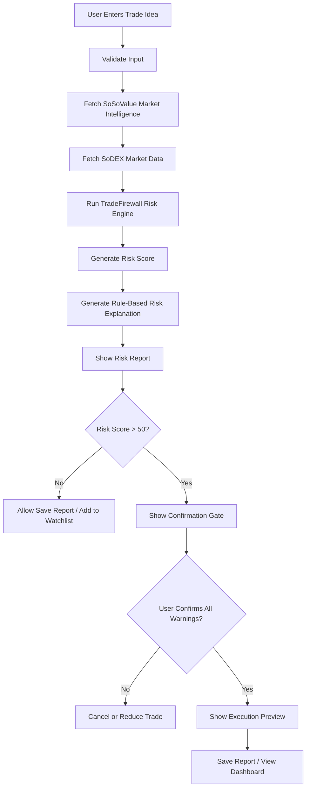

---

## System Architecture

```mermaid
flowchart LR
    subgraph Frontend[Frontend - Next.js]
        A[Landing Page]
        B[Trade Risk Engine]
        C[Trading Dashboard]
        D[Pricing Page]
        E[API Docs Page]
    end

    subgraph Backend[Backend - API Routes]
        F[/api/analyze-trade]
        G[/api/reports]
        H[/api/watchlist]
        I[/api/execution-preview]
    end

    subgraph DataSources[External Data Sources]
        J[SoSoValue API]
        K[SoDEX Public REST API]
    end

    subgraph CoreLogic[Core Logic]
        L[Risk Engine]
        M[Risk Explanation Engine]
        N[Slippage Estimator]
        O[Report Storage]
    end

    A --> B
    B --> F
    F --> J
    F --> K
    J --> L
    K --> L
    K --> N
    L --> M
    M --> B
    B --> G
    B --> H
    G --> C
    H --> C
    I --> K
```

---

## High-Level Product Flow

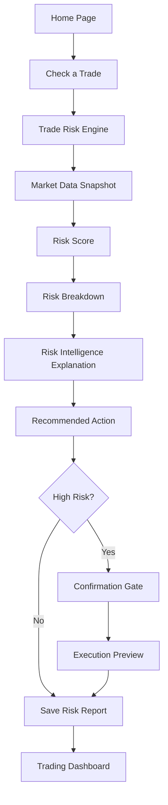

---

## User Flow

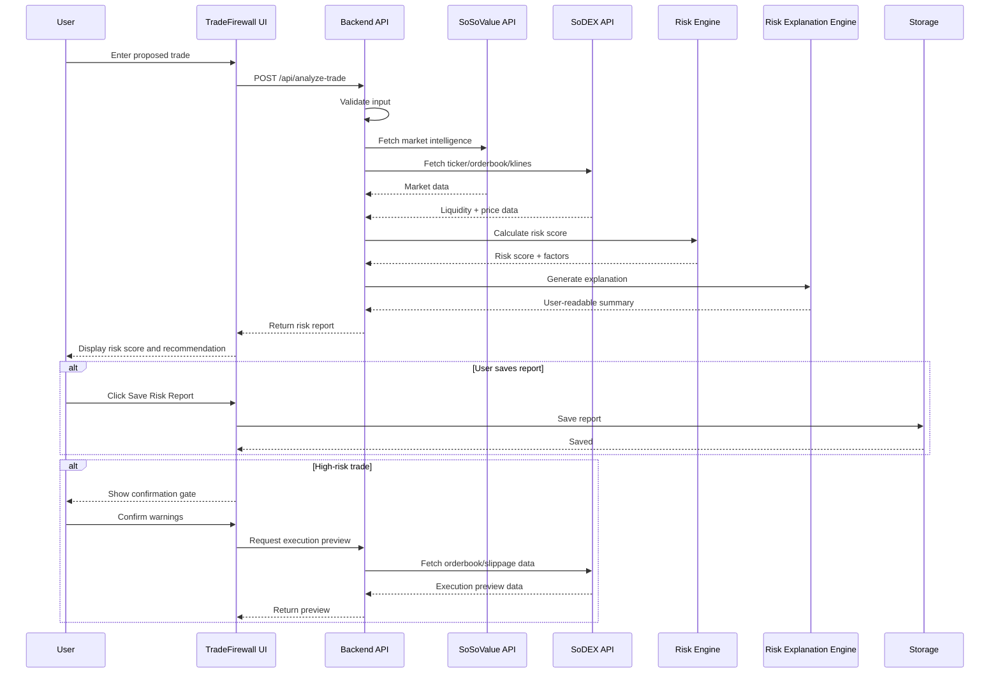

---

## Data Flow

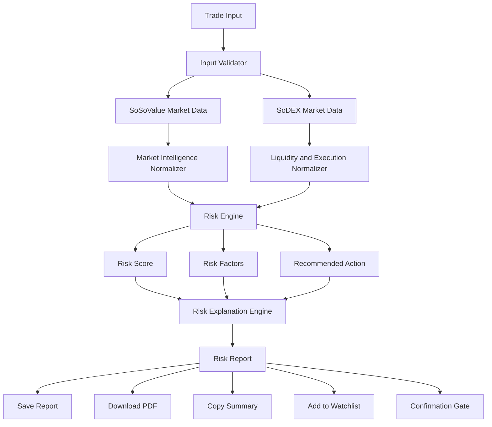

---

## Risk Engine

The risk engine is the core of TradeFirewall.

It combines:

- User trade input
- SoSoValue market intelligence
- SoDEX market data
- Liquidity conditions
- Volatility
- Momentum
- Position size
- Holding period
- User risk profile

---

## Risk Engine Inputs

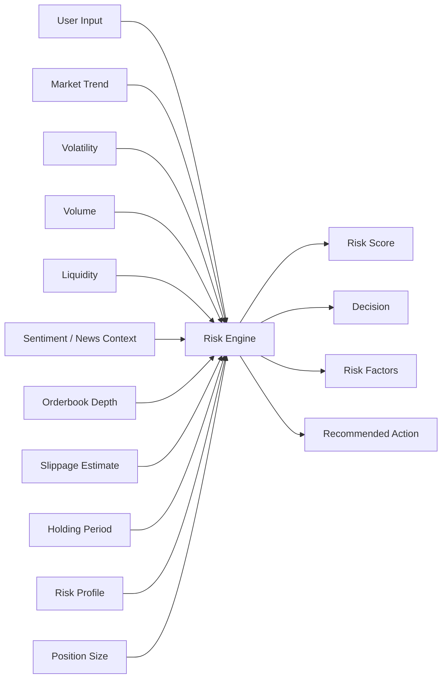

---

## Risk Factors

| Risk Factor | Description |
|---|---|
| Volatility | Measures how unstable the asset price is |
| Liquidity | Measures whether the market can handle the trade size |
| Slippage | Estimates how much price may move during execution |
| Market Momentum | Checks whether the asset is trending up, down, or sideways |
| Volume | Measures market activity and trade participation |
| Sentiment / News | Adds market intelligence context where available |
| Sector Strength | Checks broader sector/index conditions |
| Position Size | Checks whether the trade amount is too large |
| Holding Period | Shorter holding periods usually increase risk |
| Risk Profile | Conservative users get stricter scoring |
| Execution Risk | Combines slippage, liquidity, and orderbook depth |

---

## Risk Decision Tree

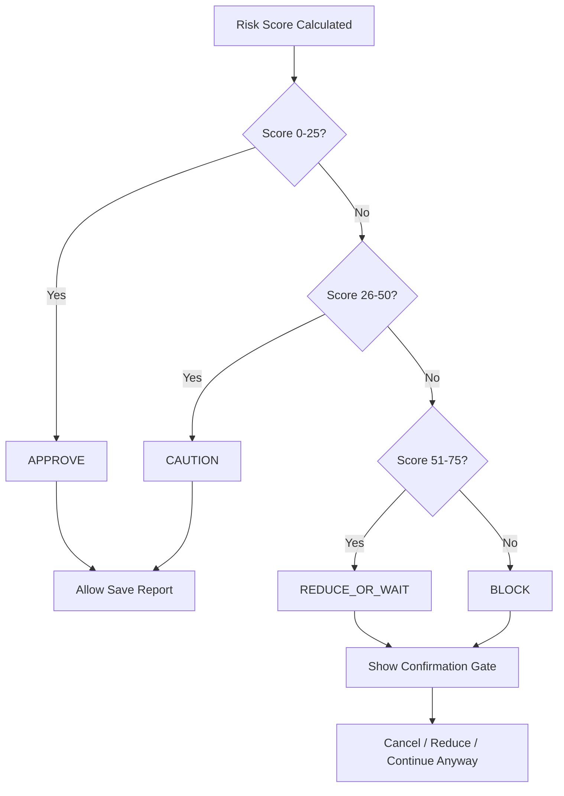

---

## Risk Score Output

```ts
type RiskDecision = "APPROVE" | "CAUTION" | "REDUCE_OR_WAIT" | "BLOCK";

type RiskReport = {
  id: string;
  symbol: string;
  action: "BUY" | "SELL";
  amountUsd: number;
  holdingPeriod: "INTRADAY" | "1_DAY" | "7_DAYS" | "30_DAYS";
  riskProfile: "CONSERVATIVE" | "BALANCED" | "AGGRESSIVE";
  riskScore: number;
  decision: RiskDecision;
  confidence: number;
  riskFactors: RiskFactor[];
  recommendedAction: string;
  suggestedPositionSize?: string;
  explanation: RiskExplanation;
  dataSourcesUsed: string[];
  createdAt: string;
};
```

---

## SoSoValue Integration

SoSoValue is used as the market intelligence layer.

TradeFirewall uses SoSoValue for:

- Market summary
- Asset trend
- Volume context
- Market intelligence
- News or sentiment context where available
- Sector or index context where available
- Risk context for the asset

---

## SoSoValue Data Flow

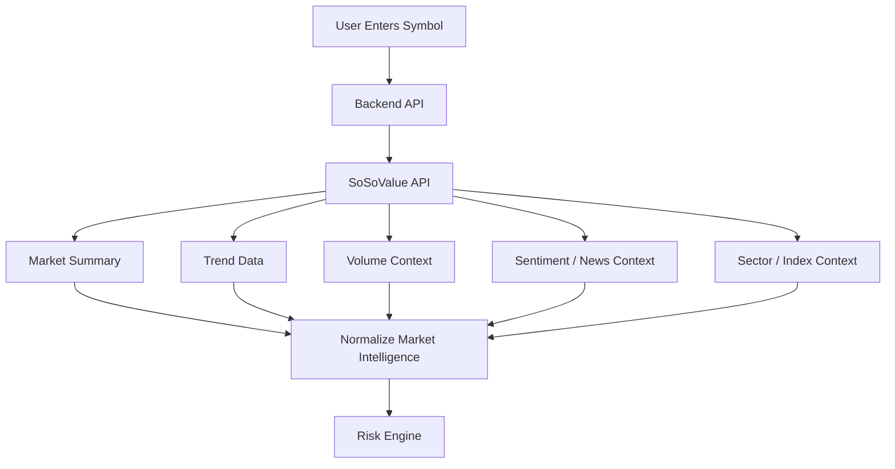

---

## SoDEX Integration

SoDEX is used as the market microstructure and execution-preview layer.

TradeFirewall uses SoDEX for:

- Public market data
- Ticker data
- Orderbook data
- Klines/candles
- Recent trades
- Liquidity checks
- Slippage estimation
- Execution preview

SoDEX market data does not require a normal API key.

SoDEX API keys are used for signing authenticated actions. In SoDEX, API keys are EVM addresses that can sign on behalf of a master account or sub-account. They are not needed for public market-data reads.

---

## SoDEX Data Flow

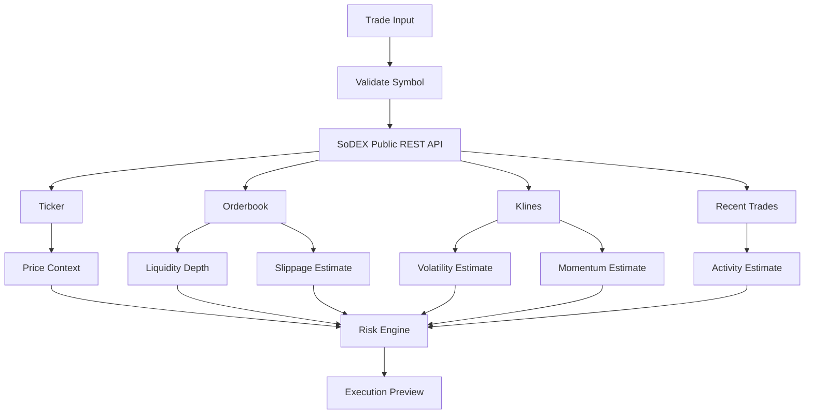

---

## SoDEX Usage Levels

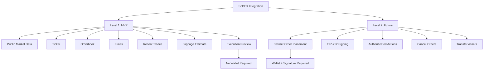

---

## Wallet and Signing Flow

Users should not connect a wallet before risk analysis.

Wallet connection is only needed for account-specific or authenticated execution actions.

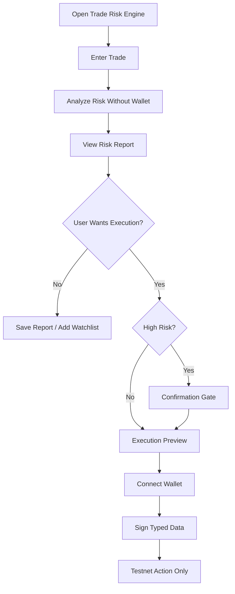

---

## Rule-Based Risk Explanation

TradeFirewall currently does not use an external AI model, LLM, OpenAI API, or GPT model.

The explanation is generated using rule-based logic.

The explanation engine takes:

- Risk score
- Decision
- Risk factors
- Recommended action
- Suggested position size
- Market data summary

And returns:

- Summary
- Main danger
- Safer action
- What to watch next
- Uncertainty note

---

## Explanation Engine Flow

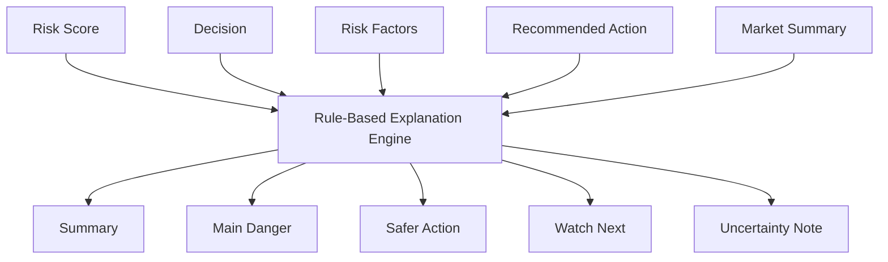

---

## Pages

TradeFirewall has five main pages.

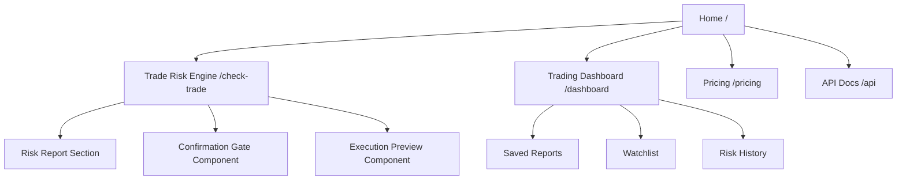

---

### 1. Home Page

Route:

```text
/
```

Purpose:

- Explain the product
- Show the value proposition
- Introduce TradeFirewall
- Push users to analyze a trade

Main CTA:

```text
Check a Trade
```

---

### 2. Trade Risk Engine

Route:

```text
/check-trade
```

Purpose:

- Analyze one proposed trade
- Generate a risk report
- Show recommendation
- Trigger confirmation gate for risky trades

---

### 3. Trading Dashboard

Route:

```text
/dashboard
```

Purpose:

- Show saved risk reports
- Show recent trade checks
- Show watchlist
- Show high-risk alerts
- Show user-generated risk history

---

### 4. Pricing Page

Route:

```text
/pricing
```

Purpose:

- Show the business model
- Explain paid plans
- Show API and community pricing

---

### 5. API Docs Page

Route:

```text
/api
```

Purpose:

- Explain how external apps can use TradeFirewall
- Show API examples
- Show request/response formats

---

## API Routes

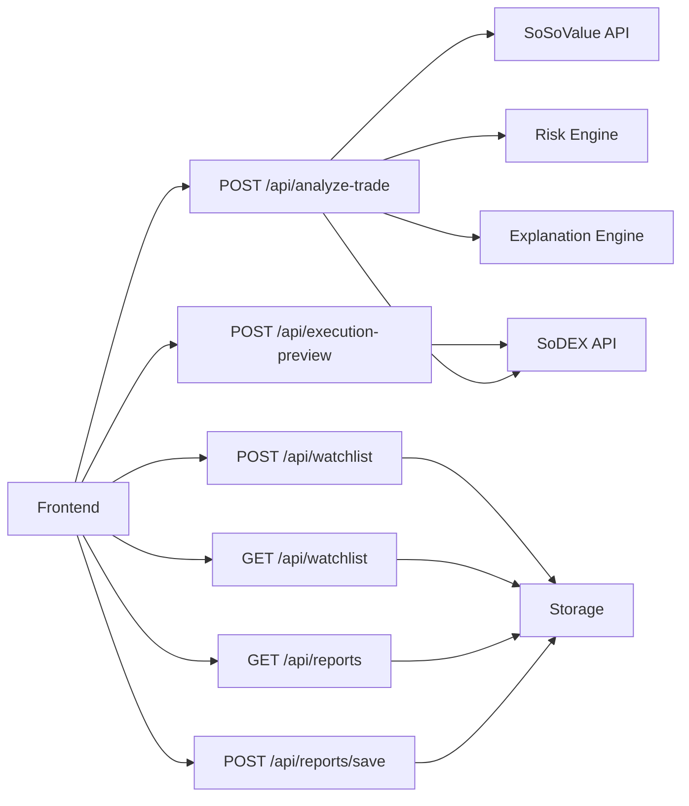

---

### POST `/api/analyze-trade`

Main endpoint for the Trade Risk Engine.

Responsibilities:

1. Validate user input
2. Fetch SoSoValue data
3. Fetch SoDEX market data
4. Run the risk engine
5. Generate rule-based explanation
6. Return full risk report

---

### GET `/api/reports`

Returns saved user-generated risk reports.

---

### POST `/api/reports/save`

Saves the current risk report.

---

### GET `/api/watchlist`

Returns user-added watchlist assets.

---

### POST `/api/watchlist`

Adds an asset to the watchlist.

---

### POST `/api/execution-preview`

Returns an execution preview using SoDEX market data.

No real trade execution by default.

---

## Storage

TradeFirewall stores only real user-generated data.

Allowed data:

- Real saved risk reports
- Real user-added watchlist assets
- Real dashboard history generated from user actions
- Real report timestamps
- Real calculated risk scores

Not allowed:

- Fake reports
- Fake watchlist assets
- Fake dashboard metrics
- Fake seeded trades
- Hardcoded market results

---

## Storage Model

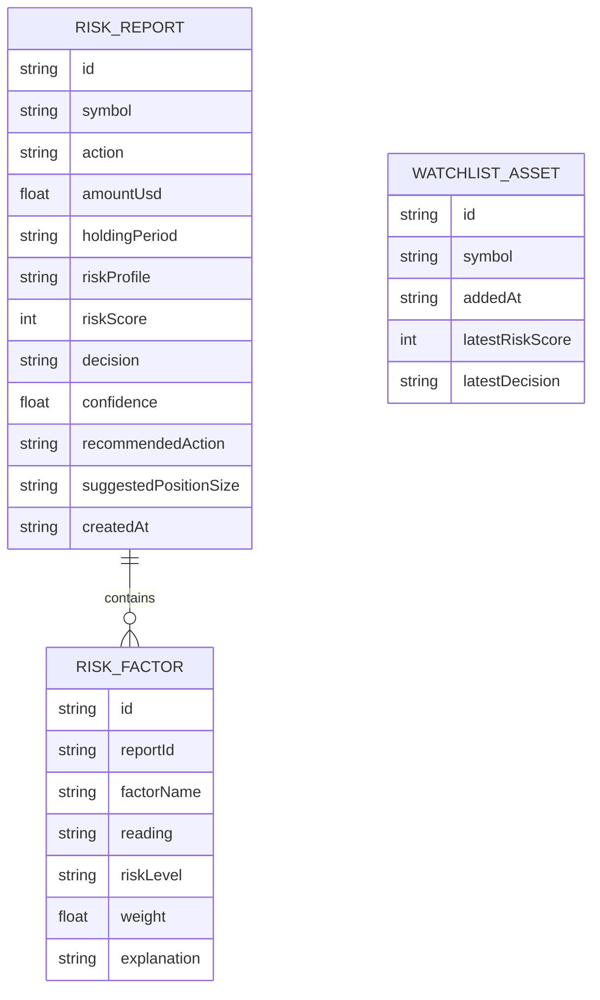

---

## Local Storage Keys

If no database is configured, TradeFirewall may use local storage for user-generated data only.

```text
tradefirewall_reports
tradefirewall_watchlist
tradefirewall_settings
```

Local storage must not be preloaded with fake reports.

---

## Button Behavior

Every visible button must work.

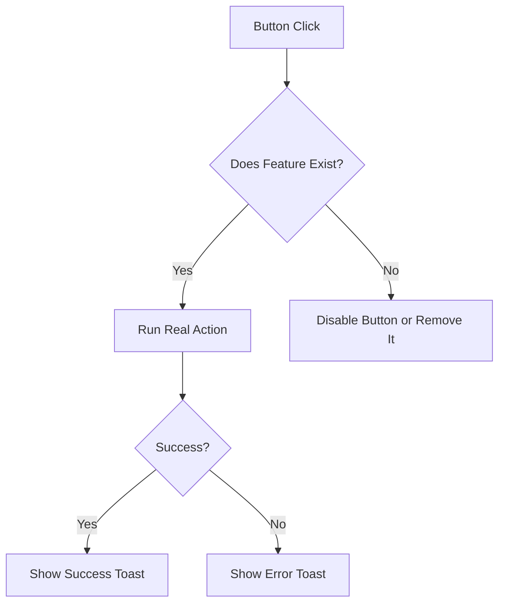

---

### Important Buttons

| Button | Behavior |
|---|---|
| Check a Trade | Navigate to `/check-trade` |
| Analyze Trade Risk | Fetch data and run risk analysis |
| Add to Watchlist | Save current asset to watchlist |
| Save Risk Report | Save current report |
| New Analysis | Reset form and current report |
| View Previous Reports | Navigate to `/dashboard#reports` |
| Download PDF | Download current report as PDF |
| Copy Summary | Copy report summary to clipboard |
| Share Report Link | Only show if report route exists |
| Add Asset | Add new watchlist asset |
| Reduce Size | Apply suggested smaller amount |
| Cancel Trade | Stop high-risk flow |
| Continue Anyway | Unlock execution preview after confirmation |

---

## Confirmation Gate

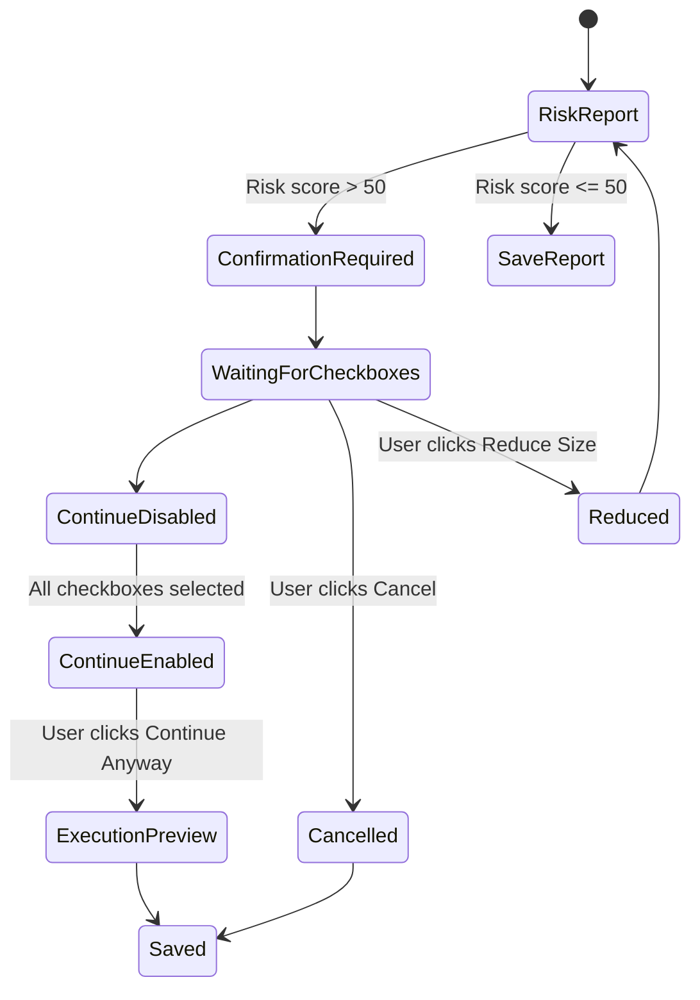

---

## Environment Variables

Create a `.env.example` file:

```env
# SoSoValue
SOSOVALUE_API_KEY=
SOSOVALUE_API_BASE_URL=

# SoDEX public market data does not require a normal API key
SODEX_API_KEY=not_required_for_market_data

# SoDEX Testnet REST
SODEX_SPOT_REST_URL=https://testnet-gw.sodex.dev/api/v1/spot
SODEX_PERPS_REST_URL=https://testnet-gw.sodex.dev/api/v1/perps

# SoDEX Testnet WebSocket
SODEX_SPOT_WS_URL=wss://testnet-gw.sodex.dev/ws/spot
SODEX_PERPS_WS_URL=wss://testnet-gw.sodex.dev/ws/perps

# Optional database
DATABASE_URL=
```

---

## Installation

```bash
npm install
```

---

## Running Locally

```bash
npm run dev
```

Open:

```text
http://localhost:3000
```

---

## Build

```bash
npm run build
```

---

## Lint

```bash
npm run lint
```

---

## Type Check

```bash
npm run typecheck
```

---

## Project Structure

```text
tradefirewall/
├── app/
│   ├── page.tsx
│   ├── check-trade/
│   │   └── page.tsx
│   ├── dashboard/
│   │   └── page.tsx
│   ├── pricing/
│   │   └── page.tsx
│   ├── api/
│   │   ├── page.tsx
│   │   ├── analyze-trade/
│   │   │   └── route.ts
│   │   ├── reports/
│   │   │   └── route.ts
│   │   ├── reports/
│   │   │   └── save/
│   │   │       └── route.ts
│   │   ├── watchlist/
│   │   │   └── route.ts
│   │   └── execution-preview/
│   │       └── route.ts
│   │
├── components/
│   ├── TradeInputForm.tsx
│   ├── MarketDataSnapshot.tsx
│   ├── RiskScoreCard.tsx
│   ├── RiskBreakdownTable.tsx
│   ├── RiskExplanationPanel.tsx
│   ├── RecommendedActionCard.tsx
│   ├── ConfirmationGate.tsx
│   ├── ExecutionPreview.tsx
│   ├── DashboardStats.tsx
│   ├── WatchlistTable.tsx
│   └── RecentRiskChecksTable.tsx
│
├── lib/
│   ├── sosovalue.ts
│   ├── sodex.ts
│   ├── riskEngine.ts
│   ├── riskExplanation.ts
│   ├── storage.ts
│   ├── pdf.ts
│   └── validation.ts
│
├── types/
│   ├── trade.ts
│   ├── risk.ts
│   ├── report.ts
│   └── market.ts
│
├── public/
│   └── assets/
│
├── .env.example
├── README.md
├── package.json
└── tsconfig.json
```

---

## Component Architecture

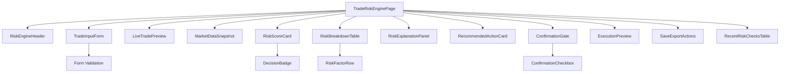

---

## Safety Rules

TradeFirewall must follow these rules:

1. No mock market data.
2. No dummy dashboard data.
3. No fake risk scores.
4. No silent API fallback.
5. No wallet required before analysis.
6. No signing before risk report.
7. No blind signatures.
8. No mainnet execution by default.
9. No auto-execution.
10. Always show “Not financial advice.”
11. High-risk trades require confirmation.
12. API keys must remain server-side.
13. All user inputs must be validated.
14. All errors must be shown clearly.

---

## Error Handling

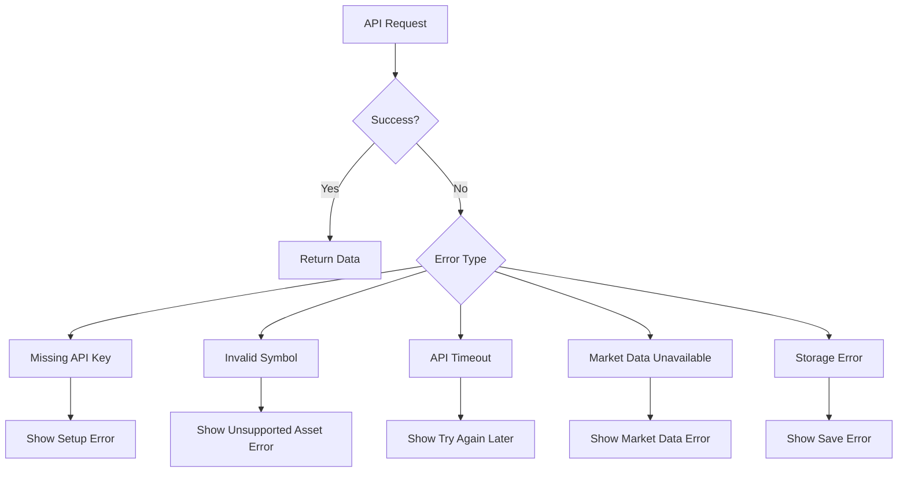

---

## Empty States

| State | Message |
|---|---|
| No reports | No trade checks yet. Start by analyzing your first trade. |
| No watchlist | No assets in your watchlist yet. |
| Missing API key | Live market data is not connected. Please configure API keys. |
| API failure | Market data is temporarily unavailable. Please try again later. |
| Unsupported asset | This asset is not supported by the connected market data sources. |

---

## Business Model

TradeFirewall can be monetized through multiple plans.

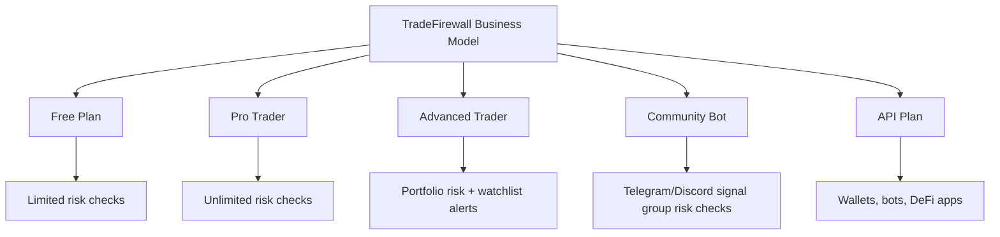

---

### Pricing Plan Ideas

| Plan | Target User | Example Price |
|---|---|---|
| Free | Beginner traders | Free |
| Pro Trader | Active retail traders | $19/month |
| Advanced Trader | Serious traders | $49/month |
| Community Bot | Signal groups and communities | $299/month |
| API Plan | Wallets, bots, DeFi apps | Usage-based |

---

## API Product Vision

TradeFirewall can become a risk API for external apps.

Example endpoint:

```http
POST /api/analyze-trade
```

Example request:

```json
{
  "symbol": "SOL",
  "action": "BUY",
  "amountUsd": 5000,
  "holdingPeriod": "INTRADAY",
  "riskProfile": "CONSERVATIVE",
  "notes": "I want to buy because SOL looks strong today."
}
```

Example response:

```json
{
  "symbol": "SOL",
  "riskScore": 82,
  "decision": "BLOCK",
  "confidence": 87,
  "recommendedAction": "Reduce position size or wait for stronger confirmation.",
  "riskFactors": [
    {
      "name": "Volatility",
      "riskLevel": "Critical",
      "explanation": "Short-term volatility is too high for an intraday conservative trade."
    },
    {
      "name": "Liquidity",
      "riskLevel": "High",
      "explanation": "Orderbook depth may not support this position size safely."
    }
  ],
  "disclaimer": "Not financial advice."
}
```

---

## Roadmap

```mermaid
timeline
    title TradeFirewall Roadmap

    section MVP
      Trade Risk Engine : User trade input
      Real Market Data : SoSoValue + SoDEX
      Risk Score : Deterministic risk engine
      Risk Explanation : Rule-based explanation
      Dashboard : Saved reports and watchlist

    section Next
      Live Alerts : Watchlist risk changes
      PDF Reports : Export risk statement
      API Access : External integrations
      Community Bot : Telegram and Discord support

    section Future
      Wallet Accounts : Account-specific history
      SoDEX Testnet Actions : Confirmed testnet execution
      LLM Layer : Optional real AI explanation
      Team Plans : Signal groups and fund managers
```

---

## Final Demo Flow

The demo should prove this full journey:

```mermaid
flowchart TD
    A[Open Landing Page] --> B[Click Check a Trade]
    B --> C[Enter Trade Details]
    C --> D[Click Analyze Trade Risk]
    D --> E[Fetch Real Market Data]
    E --> F[Calculate Risk Score]
    F --> G[Show Risk Report]
    G --> H[Show Risk Intelligence Explanation]
    H --> I[Show Recommended Action]
    I --> J{High Risk?}
    J -- Yes --> K[Show Confirmation Gate]
    K --> L[Execution Preview]
    J -- No --> M[Save Report]
    L --> M
    M --> N[View Dashboard]
    N --> O[Add Asset to Watchlist]
```

---

## Quality Checklist

Before submission:

- [ ] All pages load correctly
- [ ] Navbar links work
- [ ] Trade Risk Engine works
- [ ] No mock market data
- [ ] No fake dashboard data
- [ ] No fake reports
- [ ] SoSoValue integration is connected
- [ ] SoDEX market-data integration is connected
- [ ] Risk score uses real fetched data
- [ ] Risk explanation is labeled correctly
- [ ] Dashboard uses only real saved reports
- [ ] Watchlist uses only user-added assets
- [ ] Missing API key error works
- [ ] API failure error works
- [ ] Confirmation gate works
- [ ] Save Risk Report works
- [ ] Add to Watchlist works
- [ ] Download PDF works if visible
- [ ] Copy Summary works if visible
- [ ] Share Report Link is hidden unless implemented
- [ ] App is responsive on mobile
- [ ] `npm run build` passes
- [ ] `.env.example` exists
- [ ] README is complete

---

## Disclaimer

TradeFirewall is a risk intelligence and decision-support tool.

It does not provide financial advice.

Risk scores, explanations, and recommended actions are designed to help users understand potential trade risk before execution. Users remain responsible for their own decisions.

---

## One-Line Summary

**TradeFirewall is a pre-trade crypto risk engine that uses real market data, deterministic risk scoring, rule-based explanations, and confirmation controls to help users avoid dangerous trades before execution.**